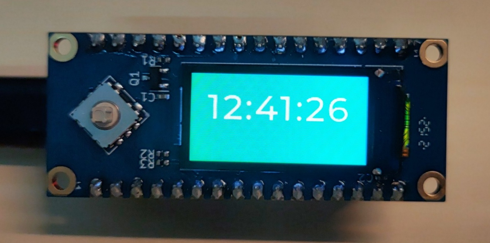

# EspNanoTool

*本程序bug太多，看得心烦，开发无限期延后。C语言写图形界面真是脑壳痛。*

## 成品说明

因为需要用到公网的串口透传，于是打算用手头剩的合宙ESP32C3-CORE开发板和0.96寸屏幕拓展板，设计一个无线串口小工具。

成品如图:

## 功能列表

- [x] 移植LVGL v8.3.11
- [x] 按键软件消抖
- [x] 移植littlefs
- [x] Wi-Fi Easy Connect™ (DPP) 配网
- [ ] 串口⇄MQTT透传
- [ ] 天气时钟
- [ ] B站数据显示
- [ ] 更好的UI界面

## 代码结构

- **main/app** 为程序的运行逻辑，例如配网/联网等
- **main/driver** 为移植所需的驱动
- **main/gui** 为NXP GUI-Guider生成的UI界面代码，手动修改过以适应需求
- **main/idf_component.yml** 为IDF 组件管理器配置，引入第三方库，库代码不可修改
- **EspNanoTool.guiguider** 为NXP GUI-Guider工程文件
- **partitions.csv** 为littlefs使用的分区表，开发板带有4MB FLASH，已经根据项目使用情况进行分区
- **sdkconfig.defaults** 默认`sdkconfig`配置

## 现存问题

- **Wi-Fi Easy Connect™ (DPP)** 配网时需要扫描二维码，但是屏幕太小，LVGL库自带的二维码又是根据内容长度自适应二维码配置，导致极小的屏幕显示很密的二维码，很难扫。
- 不知为何，扫二维码配网后，成功率极低，应该和`sdkconfig`有关，因为尝试过清空后重新配置会提供成功率，使用一段时间后成功率还是会降低。
- 由于使用的合宙经典款ESP32C3-CORE开发板，Type-C接口转的是串口，难以调试，全靠日志
