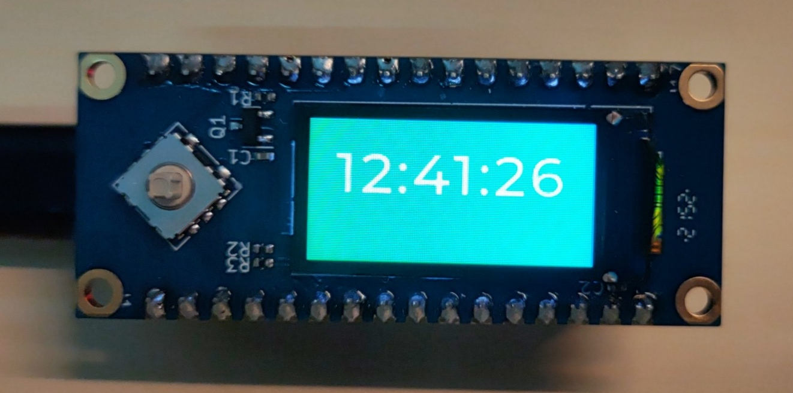

# EspNanoTool

*使用M5Stack BASIC重构此项目。*

## 成品说明

基于ESP32系列芯片开发的小工具，验证ESP32的可能性。

成品如图:



## 功能列表

- [x] 移植LVGL v8.3.11
- [x] 按键软件消抖
- [x] 移植littlefs
- [x] Wi-Fi Easy Connect™ (DPP) 配网
- [ ] 串口⇄MQTT透传
- [ ] 天气时钟
- [ ] B站数据显示
- [ ] 更好的UI界面

## 代码结构

- **main/app** 为程序的运行逻辑，例如配网/联网等
- **main/driver** 为移植所需的驱动
- **main/gui** 为NXP GUI-Guider生成的UI界面代码，手动修改过以适应需求
- **main/idf_component.yml** 为IDF 组件管理器配置，引入第三方库，库代码不可修改
- **EspNanoTool.guiguider** 为NXP GUI-Guider工程文件
- **partitions.csv** 为littlefs使用的分区表，如果开发板带有FLASH，可以根据项目使用情况进行分区
- **sdkconfig.defaults** 默认`sdkconfig`配置

## 调试

开启[`CONFIG_ESP_SYSTEM_GDBSTUB_RUNTIME`](https://docs.espressif.com/projects/esp-idf/en/v5.3.1/esp32c3/api-reference/kconfig.html#config-esp-system-gdbstub-runtime)后，可以在**IDF Monitor**中按下`Ctrl + C`以开启GDB调试，无需硬件调试设备即可粗略实现一定的调试功能。

## 现存问题

由于芯片缺陷，如果 GPIO 39 设置了中断，在 WiFi 开启时会**不断虚假触发**，参见：

- <https://esp32.com/viewtopic.php?t=14087>
- <https://github.com/espressif/esp-idf/issues/1096>
- <https://github.com/espressif/esp-idf/issues/4585>

其中提出了**一个缓解办法是关闭 WiFi 省电**，验证有效，代码如下：

```c++
esp_wifi_set_ps(WIFI_PS_NONE);
```

此外官方文档还提到开启 WiFi 会调用 ADC1 导致此问题，因此调用`adc_power_acquire`函数也可消除 GPIO36 和 GPIO39 上的毛刺，不过在新版本IDF中已经将此函数隐藏为私有，并告知已在内部进行处理。

- <https://github.com/m5stack/M5Stack/issues/52>
- <https://docs.espressif.com/projects/esp-idf/en/v4.4/esp32/api-reference/peripherals/adc.html#_CPPv412adc1_get_raw14adc1_channel_t>
